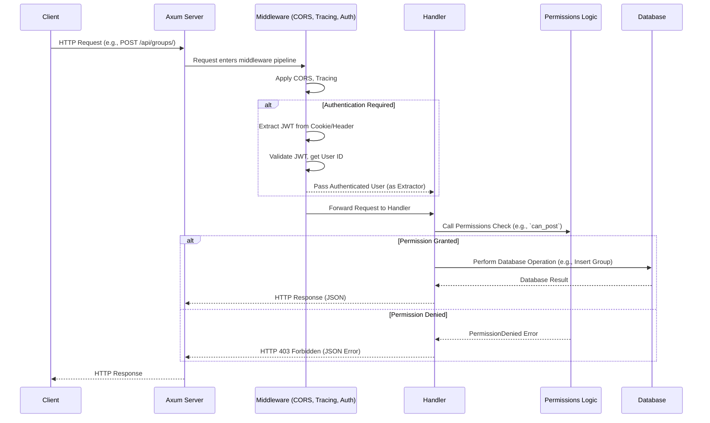

# Rust Axum API Architecture Plan

This document outlines the detailed architectural plan for recreating the existing Django API in Rust using the Axum framework and PostgreSQL as the database.

### High-Level Architecture

The overall architecture will remain a client-server model, with the Axum application serving as the backend API, interacting with a database.

```mermaid
graph TD
    A[Client Application] -->|HTTP/HTTPS Requests| B(Axum Backend API)
    B -->|Database Queries| C[Database (PostgreSQL)]
    B -->|File Storage (Optional)| D[Object Storage (e.g., S3)]
```

### Detailed Architectural Plan for Rust/Axum Backend

#### 1. Project Structure

A modular project structure will be crucial for maintainability and scalability.

```
.
├── Cargo.toml
├── .env.example
├── src/
│   ├── main.rs             # Main application entry point, server setup, routing
│   ├── models/             # Database models (structs) and schema definitions
│   │   ├── mod.rs
│   │   ├── user.rs
│   │   ├── group.rs
│   │   ├── material.rs
│   │   └── ...
│   ├── handlers/           # API endpoint logic (Axum handlers)
│   │   ├── mod.rs
│   │   ├── user.rs
│   │   ├── group.rs
│   │   ├── material.rs
│   │   └── ...
│   ├── routes/             # Axum router definitions for each module
│   │   ├── mod.rs
│   │   ├── user.rs
│   │   ├── group.rs
│   │   ├── material.rs
│   │   └── ...
│   ├── middleware/         # Custom middleware (e.g., authentication, logging)
│   │   └── mod.rs
│   ├── auth/               # JWT token handling, cookie management, authentication logic
│   │   └── mod.rs
│   ├── permissions/        # Authorization logic (e.g., `can_edit_members`)
│   │   └── mod.rs
│   ├── db/                 # Database connection pool, migrations
│   │   └── mod.rs
│   ├── errors/             # Custom error types and handling
│   │   └── mod.rs
│   ├── utils/              # Helper functions (e.g., file validation, URL validation)
│   │   └── mod.rs
│   └── lib.rs              # Re-exports and common modules
├── migrations/             # SQLx migration files
│   ├── 20250101000000_create_users_table.sql
│   └── ...
└── tests/                  # Integration and unit tests
    └── common/
    └── ...
```

#### 2. Key Rust Crates (Dependencies)

*   **`tokio`**: Asynchronous runtime for building network applications.
*   **`axum`**: Web framework for building APIs.
*   **`serde`**: For serializing/deserializing Rust structs to/from JSON.
    *   `serde_json`
    *   `serde_derive`
*   **`sqlx`**: Asynchronous ORM/query builder for database interactions. `sqlx` is generally preferred for its compile-time query checking.
    *   `sqlx-macros`
    *   `sqlx-postgres`
*   **`jsonwebtoken`**: For handling JWT creation, signing, and verification.
*   **`cookie`**: For managing HTTP cookies.
*   **`argon2`**: For password hashing (Django uses PBKDF2 by default, but Argon2 is a strong modern alternative).
*   **`uuid`**: For generating UUIDs for primary keys.
*   **`chrono`**: For handling dates and times.
*   **`dotenvy`**: For loading environment variables from a `.env` file.
*   **`anyhow`** / **`thiserror`**: For robust error handling.
*   **`tower-http`**: Axum's ecosystem for common HTTP middleware (e.g., CORS, tracing, compression).
    *   `tower-http::cors`
    *   `tower-http::trace`
*   **`tracing`** / **`tracing-subscriber`**: For structured logging.
*   **`validator`** / **`validator_derive`**: For request data validation (similar to Django serializers' validation).

#### 3. Component Translation & Implementation Details

*   **Models (`src/models/`)**:
    *   Django Models will translate to Rust `struct`s.
    *   These structs will represent the database schema and will derive `serde::Serialize` and `serde::Deserialize` for JSON conversion.
    *   `sqlx::FromRow` will be derived for mapping database rows to structs.
    *   UUID fields will use the `uuid` crate.
    *   Timestamp fields will use `chrono::DateTime<Utc>`.

*   **Database Interaction (`src/db/`)**:
    *   Use `sqlx::Pool<sqlx::Postgres>` for managing database connections.
    *   Implement functions for common CRUD operations (e.g., `find_user_by_email`, `create_group`, `get_material_by_id`).
    *   Database migrations will be managed by `sqlx-cli`, generating SQL files compatible with PostgreSQL.

*   **Handlers (`src/handlers/`)**:
    *   These are asynchronous functions that receive requests and return responses.
    *   They will use Axum's extractors for:
        *   `Json<T>`: For deserializing request bodies.
        *   `Path<T>`: For extracting path parameters (e.g., `group_id`).
        *   `State<Arc<AppState>>`: For accessing shared application state (e.g., database pool, configuration).
        *   Custom extractors for authentication and authorization.
    *   They will call functions in the `db` module to interact with the database.
    *   Responses will be `Json<T>` or `StatusCode` for success/error.

*   **Routes (`src/routes/`)**:
    *   Axum's `Router` will define the API endpoints.
    *   Routes will be organized by application (users, groups_courses, materials) and then combined in `main.rs`.
    *   Example: `Router::new().route("/groups", post(create_group).get(list_groups))`

*   **Authentication (`src/auth/`)**:
    *   **JWT Generation/Verification:** Use `jsonwebtoken` crate.
    *   **Cookie Handling:** Use `cookie` crate to set and read `access_token` and `refresh_token` from HttpOnly cookies.
    *   **Custom Extractor:** Create an Axum extractor (e.g., `AuthUser`) that reads the JWT from the cookie, validates it, and extracts the user ID. This extractor will be used in handlers that require authentication.
    *   **Token Blacklisting:** Implement a mechanism (e.g., a database table or an in-memory cache for simplicity in development) to blacklist refresh tokens upon logout.

*   **Permissions (`src/permissions/`)**:
    *   Translate Django's custom permission functions (`ensure_group_owner`, `can_edit_members`, `can_post`, `check_group_admin`, `has_higher_role`) into Rust functions.
    *   These functions will take the `AuthUser` (or similar authenticated user object) and the relevant model instance (e.g., `Group`) and return a `Result<(), AppError>`.
    *   They can be called directly within handlers or wrapped in custom Axum middleware/extractors for reusability.

*   **Error Handling (`src/errors/`)**:
    *   Define a custom `AppError` enum using `thiserror` to centralize all possible application errors (e.g., `NotFound`, `PermissionDenied`, `DatabaseError`, `ValidationError`, `AuthError`).
    *   Implement `IntoResponse` for `AppError` to automatically convert errors into appropriate HTTP responses (status codes and JSON error bodies).

*   **Middleware (`src/middleware/`)**:
    *   Use `tower-http` for common middleware like CORS and tracing.
    *   Custom middleware can be implemented for cross-cutting concerns not handled by extractors (e.g., request logging, rate limiting).

*   **File Uploads & Media Serving**:
    *   For file uploads, Axum can handle multipart form data. The files would then be saved to a designated `media` directory on the server or uploaded to an object storage service (e.g., AWS S3, MinIO).
    *   Serving static files (like uploaded materials) can be done using `tower-http::services::ServeDir`.

#### 4. Request Flow Diagram



#### 5. Development Workflow

*   **Environment Variables:** Use a `.env` file for sensitive information (database credentials, JWT secret).
*   **Testing:** Implement unit tests for individual functions (e.g., permissions, utility functions) and integration tests for API endpoints using `axum::Router::into_make_service()` and `tokio::test`.
*   **Build & Run:** `cargo build`, `cargo run`.